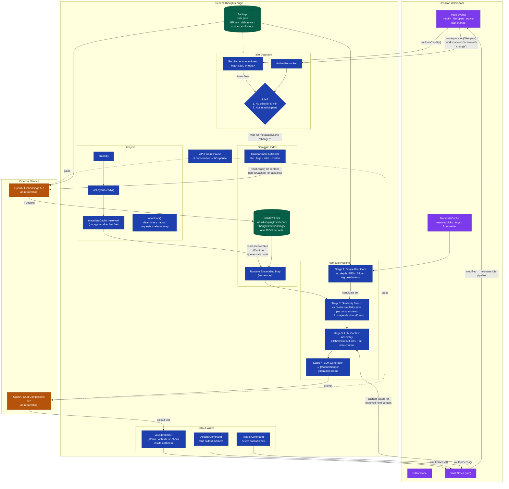
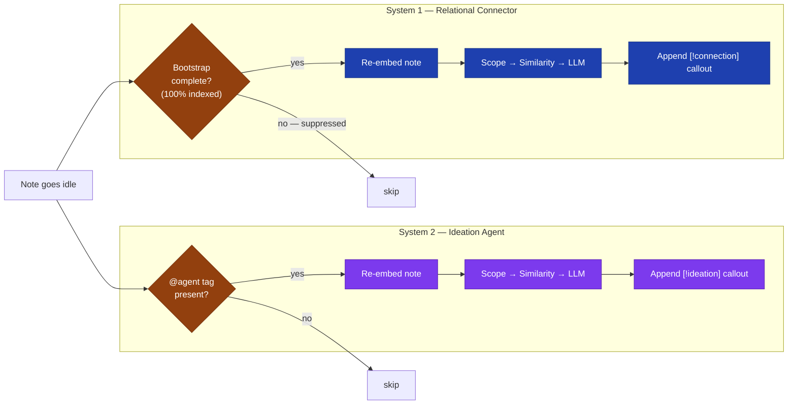
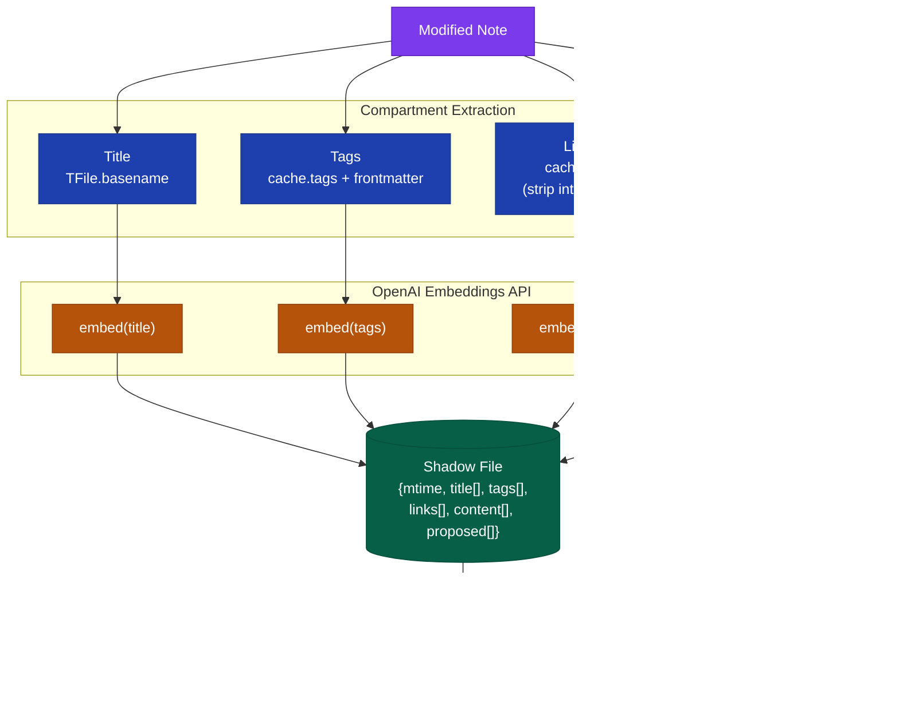
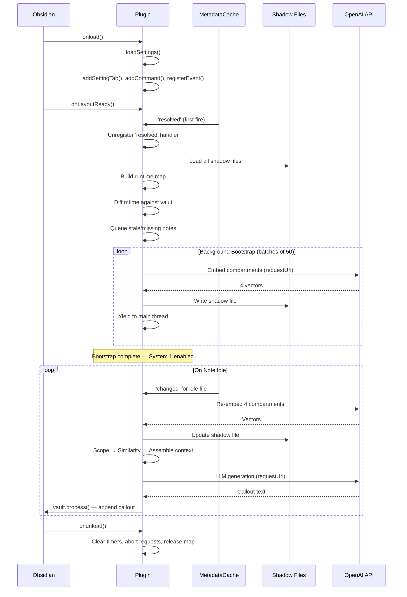

# System Architecture: Second Thoughts

## Overview

```mermaid
graph TB
    subgraph Obsidian["Obsidian Workspace"]
        VaultEvents["Vault Events<br/>modify · file-open · active-leaf-change"]
        MetadataCache["MetadataCache<br/>resolvedLinks · tags · frontmatter"]
        Editor["Editor Pane"]
        Notes["Vault Notes (.md)"]
    end

    subgraph Plugin["SecondThoughtsPlugin"]
        subgraph Lifecycle["Lifecycle"]
            OnLoad["onload()"]
            OnLayoutReady["onLayoutReady()"]
            ResolvedEvent["metadataCache 'resolved'<br/>(unregister after first fire)"]
            OnUnload["onunload()<br/>clear timers · abort requests · release map"]
        end

        subgraph IdleDetection["Idle Detection"]
            TimerMap["Per-file debounce timers<br/>Map&lt;path, timeout&gt;"]
            FocusTracker["Active file tracker"]
            IdleCheck{"Idle?<br/>1. No edits for N min<br/>2. Not in active pane"}
        end

        subgraph SemanticIndex["Semantic Index"]
            Extractor["Compartment Extractor<br/>title · tags · links · content"]
            RuntimeMap["Runtime Embedding Map<br/>(in-memory)"]
            ShadowFiles[("Shadow Files<br/>.obsidian/plugins/second-thoughts/embeddings/<br/>one JSON per note")]
        end

        subgraph Pipeline["Retrieval Pipeline"]
            ScopeFilters["Stage 1: Scope Pre-filters<br/>hop depth (BFS) · folder · tag · exclusions"]
            Similarity["Stage 2: Similarity Search<br/>4x cosine similarity (one per compartment)<br/>→ 4 independent top-K sets"]
            ContextAssembly["Stage 3: LLM Context Assembly<br/>4 labelled result sets + full note content"]
            Generation["Stage 4: LLM Generation<br/>→ [!connection] or [!ideation] callout"]
        end

        subgraph CalloutWriter["Callout Writer"]
            WriteCallout["vault.process()<br/>(atomic, with idle re-check inside callback)"]
            AcceptCmd["Accept Command<br/>strip callout markers"]
            RejectCmd["Reject Command<br/>delete callout block"]
        end

        Settings[("Settings<br/>data.json<br/>API key · debounce · scope · exclusions")]
        FailurePause["API Failure Pause<br/>5 consecutive → 60s pause"]
    end

    subgraph External["External Service"]
        EmbeddingAPI["OpenAI Embeddings API<br/>via requestUrl()"]
        ChatAPI["OpenAI Chat Completions API<br/>via requestUrl()"]
    end

    %% Lifecycle flow
    OnLoad --> OnLayoutReady
    OnLayoutReady --> ResolvedEvent
    ResolvedEvent -->|"load shadow files<br/>diff mtime<br/>queue stale notes"| RuntimeMap

    %% Event flow
    VaultEvents -->|"vault.on('modify')"| TimerMap
    VaultEvents -->|"workspace.on('file-open')<br/>workspace.on('active-leaf-change')"| FocusTracker
    TimerMap -->|"timer fires"| IdleCheck
    FocusTracker --> IdleCheck

    %% Idle → Processing
    IdleCheck -->|"wait for metadataCache 'changed'"| Extractor
    Extractor -->|"vault.read() for content<br/>getFileCache() for tags/links"| EmbeddingAPI
    EmbeddingAPI -->|"4 vectors"| ShadowFiles
    ShadowFiles --> RuntimeMap
    MetadataCache --> ScopeFilters
    RuntimeMap --> Similarity
    ScopeFilters -->|"candidate set"| Similarity
    Similarity --> ContextAssembly
    Notes -->|"cachedRead() for<br/>retrieved note content"| ContextAssembly
    ContextAssembly --> Generation
    Generation -->|"prompt"| ChatAPI
    ChatAPI -->|"callout text"| WriteCallout
    FailurePause -.->|"gates"| EmbeddingAPI
    FailurePause -.->|"gates"| ChatAPI

    %% Write flow
    WriteCallout --> Notes
    AcceptCmd -->|"vault.process()"| Notes
    RejectCmd -->|"vault.process()"| Notes
    Notes -->|"modified → re-enters idle pipeline"| VaultEvents

    %% Settings
    Settings --> IdleDetection
    Settings --> ScopeFilters
    Settings --> EmbeddingAPI

    classDef obsidian fill:#7c3aed,stroke:#5b21b6,color:#fff
    classDef plugin fill:#1e40af,stroke:#1e3a8a,color:#fff
    classDef external fill:#b45309,stroke:#92400e,color:#fff
    classDef storage fill:#065f46,stroke:#064e3b,color:#fff

    class VaultEvents,MetadataCache,Editor,Notes obsidian
    class OnLoad,OnLayoutReady,ResolvedEvent,OnUnload,TimerMap,FocusTracker,IdleCheck,Extractor,RuntimeMap,ScopeFilters,Similarity,ContextAssembly,Generation,WriteCallout,AcceptCmd,RejectCmd,FailurePause plugin
    class EmbeddingAPI,ChatAPI external
    class ShadowFiles,Settings storage
```

## System 1 vs System 2 Flow

```mermaid
flowchart LR
    Idle["Note goes idle"]

    subgraph System1["System 1 — Relational Connector"]
        S1Gate{"Bootstrap<br/>complete?<br/>(100% indexed)"}
        S1Embed["Re-embed note"]
        S1Retrieve["Scope → Similarity → LLM"]
        S1Write["Append [!connection] callout"]
    end

    subgraph System2["System 2 — Ideation Agent"]
        S2Scan{"@agent tag<br/>present?"}
        S2Embed["Re-embed note"]
        S2Retrieve["Scope → Similarity → LLM"]
        S2Write["Append [!ideation] callout"]
    end

    Idle --> S1Gate
    Idle --> S2Scan

    S1Gate -->|"yes"| S1Embed --> S1Retrieve --> S1Write
    S1Gate -->|"no — suppressed"| S1End["skip"]

    S2Scan -->|"yes"| S2Embed --> S2Retrieve --> S2Write
    S2Scan -->|"no"| S2End["skip"]

    classDef sys1 fill:#1e40af,stroke:#1e3a8a,color:#fff
    classDef sys2 fill:#7c3aed,stroke:#5b21b6,color:#fff
    classDef gate fill:#92400e,stroke:#78350f,color:#fff

    class S1Embed,S1Retrieve,S1Write sys1
    class S2Embed,S2Retrieve,S2Write sys2
    class S1Gate,S2Scan gate
```

## Data Flow: Embedding & Storage

```mermaid
flowchart TD
    Note["Modified Note"]

    subgraph Extract["Compartment Extraction"]
        Title["Title<br/>TFile.basename"]
        Tags["Tags<br/>cache.tags + frontmatter"]
        Links["Links<br/>cache.links<br/>(strip internal refs)"]
        Content["Content<br/>vault.read()"]
    end

    subgraph API["OpenAI Embeddings API"]
        E1["embed(title)"]
        E2["embed(tags)"]
        E3["embed(links)"]
        E4["embed(content)"]
    end

    Shadow[("Shadow File<br/>{mtime, title[], tags[],<br/>links[], content[], proposed[]}")]
    RuntimeMap["Runtime Map<br/>(in-memory)"]

    Note --> Title & Tags & Links & Content
    Title --> E1
    Tags --> E2
    Links --> E3
    Content --> E4
    E1 & E2 & E3 & E4 --> Shadow
    Shadow -->|"load on startup"| RuntimeMap

    classDef note fill:#7c3aed,stroke:#5b21b6,color:#fff
    classDef extract fill:#1e40af,stroke:#1e3a8a,color:#fff
    classDef api fill:#b45309,stroke:#92400e,color:#fff
    classDef storage fill:#065f46,stroke:#064e3b,color:#fff

    class Note note
    class Title,Tags,Links,Content extract
    class E1,E2,E3,E4 api
    class Shadow,RuntimeMap storage
```

## Plugin Lifecycle

```mermaid
sequenceDiagram
    participant O as Obsidian
    participant P as Plugin
    participant MC as MetadataCache
    participant FS as Shadow Files
    participant API as OpenAI API

    O->>P: onload()
    P->>P: loadSettings()
    P->>P: addSettingTab(), addCommand(), registerEvent()

    O->>P: onLayoutReady()

    MC->>P: 'resolved' (first fire)
    P->>P: Unregister 'resolved' handler

    P->>FS: Load all shadow files
    P->>P: Build runtime map
    P->>P: Diff mtime against vault
    P->>P: Queue stale/missing notes

    loop Background Bootstrap (batches of 50)
        P->>API: Embed compartments (requestUrl)
        API-->>P: 4 vectors
        P->>FS: Write shadow file
        P->>P: Yield to main thread
    end

    Note over P: Bootstrap complete — System 1 enabled

    loop On Note Idle
        MC->>P: 'changed' for idle file
        P->>API: Re-embed 4 compartments
        API-->>P: Vectors
        P->>FS: Update shadow file
        P->>P: Scope → Similarity → Assemble context
        P->>API: LLM generation (requestUrl)
        API-->>P: Callout text
        P->>O: vault.process() — append callout
    end

    O->>P: onunload()
    P->>P: Clear timers, abort requests, release map
```
