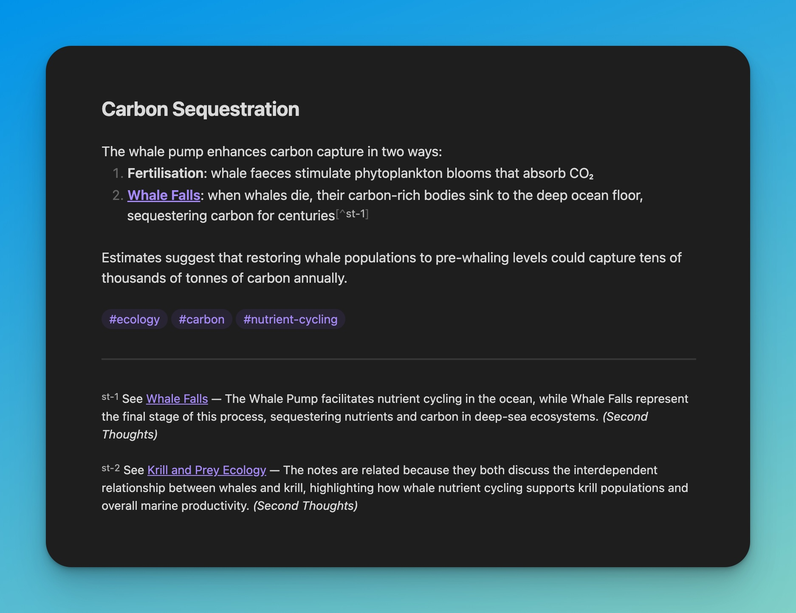
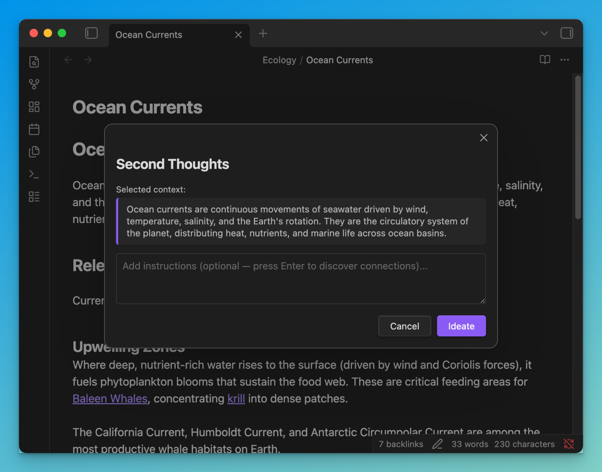
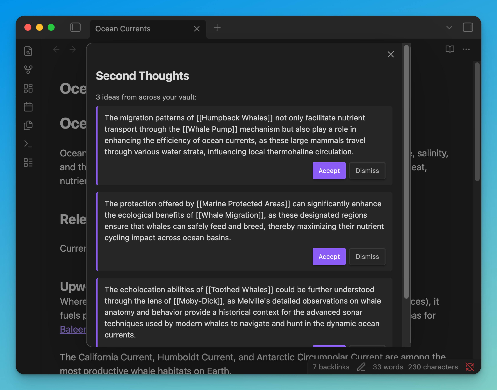
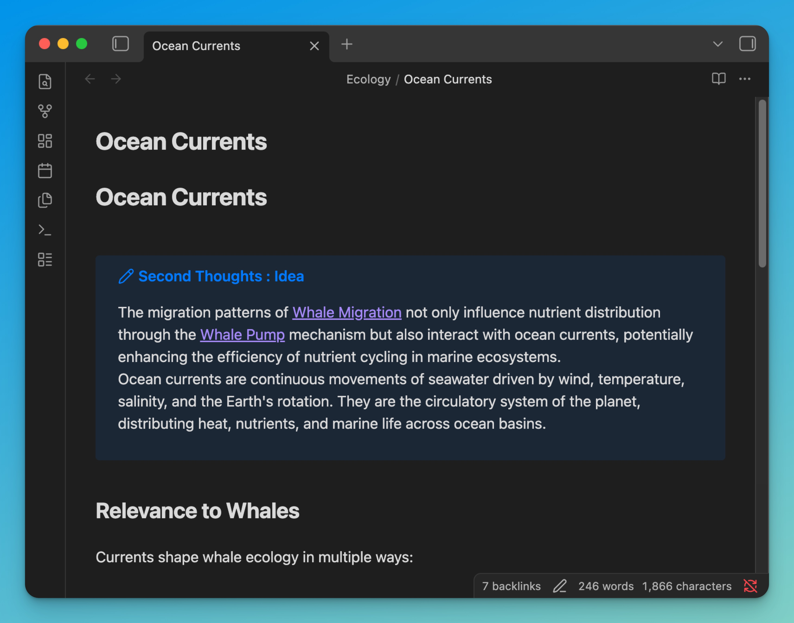

<p align="center">
  <h1 align="center">Second Thoughts</h1>
  <p align="center">
    Your notes already contain ideas you haven't had yet.<br/>
    Second Thoughts finds them.
  </p>
</p>

<p align="center">
  
  
  
  
</p>

<p align="center">
  <strong><a href="#features">Features</a></strong> · <strong><a href="#how-it-works">How It Works</a></strong> · <strong><a href="#installation">Install</a></strong> · <strong><a href="#settings">Settings</a></strong> · <strong><a href="#development">Development</a></strong>
</p>

---

An Obsidian plugin that reads your vault, understands the relationships between your notes, and surfaces connections you missed and ideas you haven't considered — automatically as footnotes, or on-demand through a modal.

---

## Features

### Footnotes — Automatic Connections

When you stop editing a note and navigate away, the plugin finds related notes by link distance and semantic similarity, then proposes connections as **native Obsidian footnotes**.

```markdown
Sperm whales are the deepest-diving mammals.[^st-1]

---

[^st-1]: See [[Whale Diving]] — both notes explore physiological
adaptations enabling cetaceans to withstand extreme depth. *(Second Thoughts)*
```

- Only connections above a configurable **confidence threshold** are proposed
- `*(Second Thoughts)*` marks AI-generated footnotes — remove it to keep, delete the footnote to discard
- A notification appears for each connection found

<p align="center">
  
</p>
<p align="center"><em>Footnotes rendered natively in Obsidian's reading view</em></p>

### Ideation — Cross-Cluster Bridging

Select text → `Cmd/Ctrl+P` → **"Ask Second Thoughts"**

The plugin finds notes that are relevant to your selection but **diverse from each other** — pulling from different areas of your vault using [Maximal Marginal Relevance](https://en.wikipedia.org/wiki/Maximal_marginal_relevance). It generates concise ideas that connect concepts you haven't explicitly linked.

Each idea can be individually **accepted** (inserted as an `[!idea]` callout) or **dismissed**.

<p align="center">
  
</p>
<p align="center"><em>Select text and invoke the command — your selection becomes the context</em></p>

<p align="center">
  
</p>
<p align="center"><em>3 bridging ideas from diverse notes across your vault</em></p>

<p align="center">
  
</p>
<p align="center"><em>Accepted ideas insert as native Obsidian callouts</em></p>

---

## How It Works

<details>
<summary><strong>The Vector Store</strong></summary>

1. **Compartment extraction** — Each note is split into four compartments: title, tags, links, and content
2. **Embedding** — Each compartment is embedded via OpenAI's `text-embedding-3-small`
3. **Caching** — Vectors are stored as JSON files in the plugin's data directory — one per note, invisible to the user
4. **Indexing** — On startup, cached embeddings are loaded into memory. Stale notes are re-embedded in batches
5. **Retrieval** — Features query the index using cosine similarity, BFS scope filtering, and MMR diversity selection

The store updates incrementally. When a note changes and goes idle, only that note is re-embedded. No bulk reprocessing. No external database. Everything stays inside `.obsidian/plugins/`.

</details>

<details>
<summary><strong>Footnotes Pipeline</strong></summary>

1. Note goes idle (configurable delay after last edit)
2. Candidates found via link-distance BFS
3. Ranked by cosine similarity across all compartments
4. Filtered by confidence threshold
5. For each qualifying candidate, an LLM generates a one-sentence reason
6. Footnote reference inserted at the most relevant paragraph
7. Footnote definition appended at the bottom

</details>

<details>
<summary><strong>Ideation Pipeline</strong></summary>

1. User selects text and invokes the command (or uses full note if no selection)
2. Selection is embedded on the fly
3. MMR selects 5 diverse notes — relevant to the selection but dissimilar to each other
4. LLM generates bridging ideas that connect concepts across the diverse sources
5. User accepts or dismisses each idea individually

</details>

---

## Installation

> This plugin is not yet in the Obsidian Community Plugin directory. Install manually using the steps below.

### Requirements

- [Obsidian](https://obsidian.md/) 1.12.0 or later (desktop only)
- An [OpenAI API key](https://platform.openai.com/api-keys) (used for embeddings and LLM generation)

### Steps

1. Download `main.js`, `manifest.json`, and `styles.css` from the [latest release](https://github.com/Liamhbray/second-thoughts/releases/latest)
2. In your vault, navigate to `.obsidian/plugins/` and create a folder called `second-thoughts`
3. Copy the three downloaded files into that folder
4. Open Obsidian and go to **Settings > Community Plugins**
5. Enable **Restricted Mode** to be off (if not already)
6. Find **Second Thoughts** in the installed plugins list and enable it
7. Go to **Settings > Second Thoughts** and enter your OpenAI API key
8. Start writing — footnotes will appear automatically after your notes go idle

<details>
<summary><strong>Updating</strong></summary>

To update, download the latest `main.js`, `manifest.json`, and `styles.css` from the [releases page](https://github.com/Liamhbray/second-thoughts/releases) and replace the files in `.obsidian/plugins/second-thoughts/`. Restart Obsidian or reload the plugin.

</details>

---

## Settings

### Features

| Setting | Default | Description |
|---------|---------|-------------|
| Enable footnotes | `On` | Auto-generate footnote connections on idle |
| Enable ideation | `On` | Show the "Ask Second Thoughts" command |

<details>
<summary><strong>Footnotes</strong></summary>

| Setting | Default | Description |
|---------|---------|-------------|
| Processing delay | `5 min` | Time after last edit before generation |
| Footnote link depth | `3` | Link hops to search for candidates |
| Retrieval depth | `5` | Similar notes per search |
| Connection confidence | `0.5` | Minimum similarity (0.2–0.9) for a footnote |

</details>

<details>
<summary><strong>Ideation</strong></summary>

| Setting | Default | Description |
|---------|---------|-------------|
| Model | `gpt-4o-mini` | gpt-4o-mini (fast) or gpt-4o (creative) |
| Ideas per generation | `3` | Bridging ideas per request |

</details>

<details>
<summary><strong>Exclusions</strong></summary>

| Setting | Default | Description |
|---------|---------|-------------|
| Excluded folders | — | Folders exempt from processing |
| Excluded tags | — | Tags that exempt notes |

</details>

---

## Development

```bash
git clone https://github.com/Liamhbray/second-thoughts.git
cd second-thoughts
npm install
echo "OPENAI_API_KEY=sk-..." > .env
npm run build
```

First run: open `seed-vault/` as a vault in Obsidian and enable the plugin.

| Command | Description |
|---------|-------------|
| `npm run build` | Build + deploy to seed vault |
| `npm test` | Unit tests |
| `npm run e2e` | E2E tests via Obsidian CLI |
| `npm version patch` | Bump version + auto-release |

<details>
<summary><strong>Architecture</strong></summary>

```
src/
  core/             — vector store, LLM provider, similarity, idle detection
  features/
    footnotes/      — automated footnote connections
    ideation/       — modal-driven cross-cluster bridging
    _template/      — documented template for adding new features
  main.ts           — thin wiring (~260 lines)
```

Features are isolated modules that only import from `core/`. Adding a new feature means copying `_template/`, implementing the logic, and adding one `activate()` call. See [CONTRIBUTING.md](CONTRIBUTING.md).

</details>

---

## Privacy

Note content is sent to the OpenAI API for embedding and generation. No data is stored externally. Embeddings are cached locally inside your vault's plugin directory.

---

<p align="center">
  <a href="LICENSE">MIT License</a> · <a href="CONTRIBUTING.md">Contributing</a> · <a href="CHANGELOG.md">Changelog</a>
</p>
